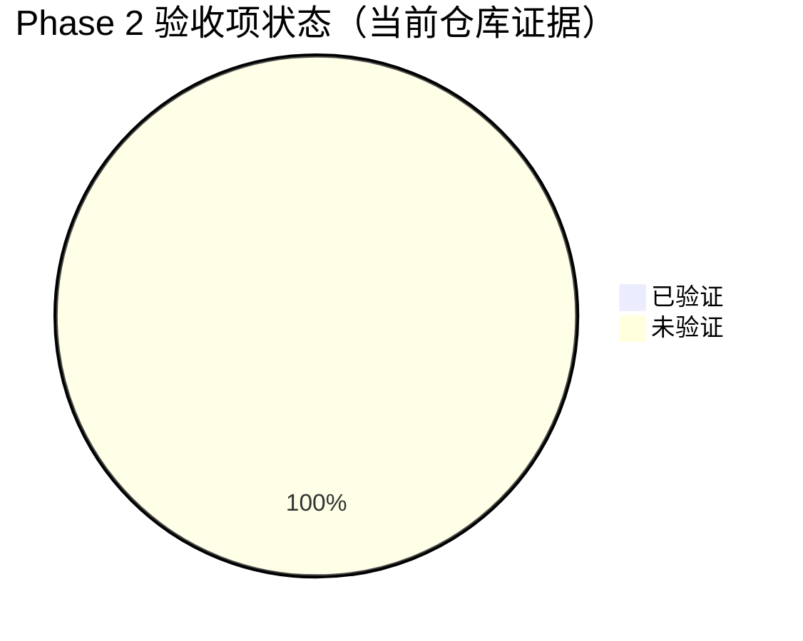

# ConfTopo-Agent: Confidence-Aware Semantic-Topological Memory for Task-Driven Long-Horizon Navigation

> **定位**：ConfTopo-Agent 是一个**面向长时程任务驱动导航的完整智能体**。
> 其核心创新是置信度感知的语义拓扑长期记忆与任务驱动图检索规划（ConfTopo Core），
> 在不同底层导航控制器上实现目标导向探索、长期记忆复用和语义图规划。
>
> **核心贡献**：
> - **C1**: 置信度感知的语义拓扑记忆 — 多粒度、多因子置信度、可持续增长的世界模型
> - **C2**: 任务驱动图检索规划 — goal-conditioned node-wise matching，目标导向而非全图无差别 attention
> - **C3**: 跨目标记忆复用验证 — 在多目标连续导航中证明长期记忆的累积价值
>
> **模型 vs 模块**：
> - ConfTopo-Agent 是**完整导航模型**（感知 → 记忆 → 规划 → 决策 → 控制）
> - ConfTopo Core 是该模型中的**核心创新部分**（记忆 + 规划），设计为可复用结构
> - 不同 benchmark 只是底层控制器不同，高层 Core 逻辑一致
>
> **Benchmark 定位**：
> - **主 benchmark: GOAT-Bench** → ConfTopo-GOAT (主模型版本)
> - **辅助 benchmark: SOON** → ConfTopo-SOON
> - **工程验证: R2R-CE** → ConfTopo-ETPNav

---

## 总体架构

### ConfTopo-Agent 完整结构

```
ConfTopo-Agent
├── Goal Understanding (目标理解)
│   └── LLM GoalGraph Parser (离线预计算)
│       ├── R2R: instruction → SubGoal 序列
│       ├── GOAT: object/description goal → GoalNode
│       └── SOON: abstract description → GoalNode
│
├── Perception (感知)
│   ├── LightPerceiver: CLIP semantic scoring (每步)
│   └── HeavyPerceiver: GroundingDINO object grounding (按需)
│
├── ConfTopo Core (核心创新)
│   ├── DynamicTopoMap: 统一语义拓扑图
│   ├── Confidence System: 多因子置信度管理
│   ├── Multi-granularity: 自适应粒度合并/剪枝
│   └── GraphRetrievalPlanner: goal-conditioned node scoring
│
├── High-level Decision (高层决策)
│   ├── 选择 frontier-like node (探索)
│   ├── 选择 object / room / landmark node (导航)
│   ├── 主动探索触发 (低置信/无匹配时)
│   └── 停止判断 (目标达到确认)
│
└── Low-level Controller (底层控制，不是创新点)
    ├── ConfTopo-GOAT: PointNav DD-PPO controller
    ├── ConfTopo-ETPNav: waypoint teleport controller
    └── ConfTopo-SOON: viewpoint graph action
```

### 三个模型版本

```
ConfTopo-GOAT (主模型, 主实验)
  输入: 单视角 RGB (egocentric, ~79° HFOV, 无深度) + object / language / image goal
  感知: RGB → CLIP 语义标注; RGB → 单目深度估计 (可选) 或纯视觉 frontier
  记忆: 随 agent 移动/转向逐步积累拓扑节点
  Core: DynamicTopoMap + GraphRetrievalPlanner → next_target_position
  控制: PointNav DD-PPO 执行底层运动 (唯一外部组件)
  特色: 多目标间记忆不清空, 跨目标复用

ConfTopo-ETPNav (工程验证)
  输入: 路线指令 (R2R-CE)
  ConfTopo Core: 语义记忆 + graph retrieval → candidate node scores
  控制: ETPNav waypoint navigation (gate * etp_logits + (1-gate) * retrieval_scores)
  特色: 证明 Core 在不同控制器上都有效

ConfTopo-SOON (辅助验证)
  输入: 抽象目标描述
  ConfTopo Core: goal graph alignment → target viewpoint scoring
  控制: viewpoint graph navigation
  特色: 证明 goal graph 对抽象描述的理解能力
```

### 论文表述

> We propose **ConfTopo-Agent**, a complete task-driven navigation agent for
> long-horizon multi-goal scenarios. From egocentric RGB observations alone,
> ConfTopo-Agent incrementally builds a confidence-aware semantic-topological
> memory and performs goal-conditioned graph retrieval to select the next
> navigation target. Only the low-level motor controller (PointNav) is external;
> all perception, memory, frontier generation, and planning are performed by
> the agent itself. We evaluate on GOAT-Bench (multi-goal), SOON (abstract
> goals), and R2R-CE (route instructions).

## 核心创新点

### C1: Confidence-Aware Semantic Topological Memory (置信度感知语义拓扑记忆)

传统 VLN 的拓扑图只存 waypoint 位置和视觉 embedding，不包含语义信息、不区分信息可靠程度、不做多粒度管理。我们提出：

- **统一拓扑记忆**：将 object、landmark、room、frontier 统一为图节点，与 waypoint 共存于一张拓扑图
- **多因子置信度**：每个节点/边有基于检测可靠性、多视角一致性、任务相关性、时空衰减的复合置信度
- **自适应粒度**：近处保留细粒度（object-level），远处只保留粗粒度（landmark/room），通过置信度驱动的合并/剪枝实现

这使得 agent 拥有一个**可持续增长、自适应精简的世界模型**，而不是每步只看当前观测。

### C2: Task-Driven Graph Retrieval Planning (任务驱动图检索规划)

传统方法在固定拓扑图上做 attention/scoring，我们将规划过程重新定义为**图检索问题**：

- **指令结构化**：LLM 离线将指令解析为 goal graph（目标-地标-房间-关系约束）
- **目标导向节点匹配**：每步从记忆图中对每个节点做 goal-conditioned scoring（而非全图无差别 attention）
- **置信度加权对齐**：goal graph 到 memory subgraph 的对齐考虑节点置信度，低置信区域触发主动探索
- **规划即检索**：next target = 记忆图中 goal-conditioned score 最高的未访问节点

这使得规划具有**目标导向性**和**记忆复用能力**——在多目标任务中，前面建立的记忆可以直接服务后续目标。

### C3: 连续多目标环境中长期记忆的复用验证

以 GOAT-Bench 为主 benchmark 验证：
- **GOAT-Bench (主)**：连续多目标导航 (find sofa → find sink → find bed → find table)，前面建立的 living room / kitchen / bedroom 语义拓扑记忆直接服务后续目标，证明长期记忆的**累积价值**
- **SOON (辅助)**：抽象目标描述 (e.g. "the white chair near the window in the bedroom") 需要 object attribute + landmark + room 联合推理，证明 goal graph 的**语义对齐能力**
- **R2R-CE (工程验证)**：证明模块接入后基础连续 VLN 能力不退化，长轨迹子集有改善

## 工程设计原则

1. **完整 Agent，Core 可复用** - ConfTopo-Agent 是完整模型；Core 部分与控制器无关
2. **统一循环** - 所有版本共享 `observe → update_memory → plan → act` 循环
3. **统一拓扑表示** - 不用栅格，所有信息统一为图节点+边
4. **渐进式融合** - 先 bias (Phase 2)，后 retrieval (Phase 4)，最后端到端
5. **离线优先** - LLM 不在线调用，goal graph 预计算缓存
6. **退化安全** - 可禁用 Core 模块（alpha=0 / disabled），验证基线

---

## 统一拓扑图设计

```
+----------------------------------------------------+
|            DynamicTopoMap (统一拓扑图)               |
+----------------------------------------------------+
| 节点类型:                                           |
|   * waypoint_visited  (已访问路径点，有 embedding)    |
|   * waypoint_ghost    (未访问候选 = frontier-like)   |
|   * landmark          (显著地标，附着在 waypoint 上)  |
|   * object            (检测到的物体)                 |
|   * room              (房间/区域抽象节点)            |
+----------------------------------------------------+
| 边类型:                                            |
|   * navigable         (两个 waypoint 间可通行)       |
|   * observed_at       (object/landmark -> waypoint) |
|   * belongs_to        (waypoint/object -> room)     |
|   * visible_from      (landmark 从某 waypoint 可见)  |
+----------------------------------------------------+
| 节点属性:                                           |
|   * position (3D)                                   |
|   * embedding (语义向量)                            |
|   * confidence (多因子置信度)                        |
|   * step_id (发现时间)                              |
|   * label (文本标签)                                |
+----------------------------------------------------+
```

### Frontier-like Node 定义

ConfTopo-Agent 自己生成 frontier-like node，不依赖外部模块：

> **frontier-like node = 从当前位置深度观测推断的、尚未访问的可通行候选拓扑节点**

生成方式（纯拓扑，无 occupancy grid，纯 RGB 单视角连续环境）：

```python
def extract_frontiers_from_rgb(rgb_image, agent_state, topo_map):
    """从当前 RGB 帧生成 frontier-like nodes (无深度, 纯视觉)"""
    frontiers = []
    agent_pos = agent_state.position
    agent_heading = agent_state.heading

    # 方式 1: 基于 agent 位移的拓扑 frontier
    # agent 每走一段距离，在未探索方向生成 frontier
    unexplored_dirs = get_unexplored_directions(agent_pos, agent_heading, topo_map)
    for direction in unexplored_dirs:
        est_pos = agent_pos + direction * step_size
        frontiers.append(FrontierNode(
            position=est_pos,
            direction=direction,
            confidence=0.2,
        ))

    # 方式 2: 基于视觉线索的 frontier
    # 看到门/走廊/开放空间 → 生成该方向的 frontier
    visual_cues = detect_openings(rgb_image)  # 门、走廊、开放区域
    for cue in visual_cues:
        direction = pixel_to_direction(cue.position, agent_heading)
        est_pos = agent_pos + direction * default_frontier_distance
        if not topo_map.has_nearby_visited(est_pos, radius=1.0):
            frontiers.append(FrontierNode(
                position=est_pos,
                direction=direction,
                confidence=0.4,  # 有视觉证据, 比纯方向的更可信
                visual_cue=cue.label,
            ))
    return frontiers
```

**关键设计 — 纯 RGB, 无深度, 单视角连续环境：**

- **无深度传感器** → 不能从 depth 推断可通行性
- **Frontier 生成策略**:
  1. **位移式**: agent 移动时，记录已访问位置；未访问方向 = frontier
  2. **视觉式**: 从 RGB 识别"开放空间线索"(门、走廊、空旷区域) → 生成 frontier
  3. **回溯式**: 经过十字路口时，未选择的方向记为 frontier
- Frontier 随 agent 移动/转向**逐步积累**到 DynamicTopoMap
- 已写入 topo map 的 frontier 持久存在，不会因为转头看不到就丢失
- 这正是长期记忆的价值：**看过的信息记在图里，不需要重复观测**

**ConfTopo-Agent 的完整感知-记忆-规划-决策闭环自己完成，只有底层运动控制（forward/left/right/stop）交给 PointNav。**

### 多粒度信息管理

```
距离 agent 近 (< near_radius):
  -> 所有 waypoint nodes (visited + ghost)
  -> 所有 object / landmark nodes
  -> 完整局部拓扑

距离 agent 中 (near_radius ~ far_radius):
  -> waypoint nodes
  -> 高 confidence landmark nodes
  -> room nodes

距离 agent 远 (> far_radius):
  -> 只保留 landmark 和 room 节点
  -> ghost 合并为方向性 frontier 节点
  -> confidence 持续衰减
```

### Confidence 更新公式

**语义节点 (object / landmark) 置信度:**

```
C_semantic =
    w1 * detection_confidence      (VLM 输出置信度)
  + w2 * multi_view_consistency    (多次/多角度检测到 -> 加分)
  + w3 * instruction_relevance     (和当前目标相关 -> 加分)
  + w4 * room_prior_consistency    (在合理 room 中检测到 -> 加分)
  - w5 * time_decay                (长时间未重新观测 -> 衰减)
  - w6 * redundancy                (重复冗余节点 -> 合并或降权)
```

**拓扑节点 (waypoint / ghost) 置信度:**

```
C_topo =
    w1 * navigability              (是否确认可通行)
  + w2 * execution_success         (去过且成功 -> 高)
  - w3 * collision_history         (碰撞/失败 -> 降低)
  - w4 * backtrack_frequency       (频繁回退 -> 降低)
  - w5 * distance_decay            (距离远 -> 衰减)
```

---

## Instruction Graph 设计

### 双模式 Schema

支持两种任务类型，通过 `goal_type` 区分：

**模式 A: 路线指令 (R2R-CE)**

```python
class SubGoal:
    id: int
    action: str              # go_forward / turn_left / stop
    landmark: Optional[str]  # "kitchen island"
    landmark_embedding: np.ndarray
    spatial_relation: str    # past / at / towards
    implied_room: Optional[str]
    termination_condition: str
    status: str              # pending / active / completed
```

**模式 B: 目标约束 (GOAT-Bench / SOON)**

```python
class GoalNode:
    target_object: str          # sink / sofa / table
    target_embedding: np.ndarray  # CLIP embedding of target
    attributes: List[str]       # white / wooden / small
    room_prior: List[str]       # kitchen / bathroom
    landmarks: List[str]        # nearby landmark cues
    relations: List[Relation]   # near X / left of Y / in front of Z
    goal_type: str              # category / description / image
    confidence: float
```

**统一接口:**

```python
class InstructionGraph:
    goal_type: str              # "route" (R2R) or "object_goal" (GOAT/SOON)
    sub_goals: List[SubGoal]    # 模式 A
    goal_nodes: List[GoalNode]  # 模式 B
    current_idx: int = 0

    def get_current_goal(self) -> Union[SubGoal, GoalNode]
    def advance() -> bool
    def is_complete() -> bool
    def get_all_landmark_embeddings() -> np.ndarray
    def get_target_embeddings() -> np.ndarray  # 模式 B
    def set_current_goal(self, goal: GoalNode)  # GOAT 多目标切换
```

**Phase 1 同时实现两种模式** — 因为主 benchmark (GOAT-Bench) 用模式 B。

---

## Phase 1: ConfTopo Core + GoalGraph（2 周）

### 目标

实现 ConfTopo 核心模块（与框架无关）+ GoalGraph 预计算（覆盖 GOAT/SOON/R2R 三种任务）+ 在 ETPNav 上做兼容性验证。

### 任务清单

#### 1.1 GoalGraph 预计算（三种任务）

**R2R 路线指令:**
```
输入: R2R 全量指令 (train / val_seen / val_unseen)
处理: vLLM + Qwen2.5-7B -> SubGoal 序列
输出: data/goal_graphs/r2r/{split}_goal_graphs.json
```

**GOAT-Bench 多目标:**
```
输入: GOAT episode definitions (category / instance / description goals)
处理: 目标 → GoalNode (target + room_prior + attributes)
       对 description 类: vLLM 解析属性和空间关系
输出: data/goal_graphs/goat/{split}_goal_graphs.json
```

**SOON 抽象目标:**
```
输入: SOON 指令 (object + attribute + relation + room)
处理: vLLM 解析为 GoalNode (target + attributes + landmarks + relations)
输出: data/goal_graphs/soon/{split}_goal_graphs.json
```

- 为所有目标/landmark 预计算 CLIP text embedding
- Fallback: 解析失败退化为 {target_object: raw_text, room_prior: []}

#### 1.2 InstructionGraph 类（双模式完整实现）

文件: `conftopo/memory/instruction_graph.py`

- SubGoal dataclass (R2R)
- GoalNode dataclass (GOAT/SOON)
- InstructionGraph 统一接口
- `set_current_goal()` — GOAT 多目标切换
- CLIP embedding 加载
- 单元测试

#### 1.3 DynamicTopoMap 核心实现

文件: `conftopo/memory/dynamic_topo_map.py`

- SemanticNode dataclass
- DynamicTopoMap 基类（不继承 ETPNav 的 GraphMap，独立实现）
- 核心方法: add_node / add_edge / update_confidence / decay / prune / query_subgraph
- 面向通用接口，不绑定 ETPNav 的 node_pos / ghost 概念
- 单元测试

#### 1.4 ETPNav Adapter（兼容性验证）

文件: `conftopo/adapters/etpnav_adapter.py`

- 将 ETPNav GraphMap 的 visited/ghost 映射到 DynamicTopoMap 节点
- 包装层：让 DynamicTopoMap 对 ss_trainer_ETP.py 表现得像原始 GraphMap
- 验证：替换后原始 ETPNav 训练 3 iterations 无报错，loss 一致

#### 1.5 配置文件

文件: `conftopo/config.py`

```python
@dataclass
class ConfTopoConfig:
    enabled: bool = True
    goal_graph_dir: str = "data/goal_graphs"

    # Memory
    confidence_decay: float = 0.95
    near_radius: float = 5.0
    far_radius: float = 15.0
    prune_threshold: float = 0.1

    # Perception
    light_every_step: bool = True
    heavy_interval: int = 5
    heavy_on_frontier: bool = True

    # Decision
    alpha: float = 0.0  # Phase 1 不开 bias
    beta: float = 0.0
    normalize_scores: bool = True
    use_retrieval: bool = False  # Phase 4 开启
```

#### 1.6 可视化工具

文件: `conftopo/tools/visualize_topo_map.py`

- 输入：DynamicTopoMap 实例
- 输出：topo map 图 (节点颜色=类型, 大小=confidence, 标注=label)

### 验收标准

- [ ] `data/goal_graphs/` 三种任务文件就位
- [ ] InstructionGraph 双模式 load/advance/set_current_goal 功能正常
- [ ] DynamicTopoMap 独立单元测试通过 (add/query/prune/confidence)
- [ ] ETPNav Adapter: 替换后原始训练不报错，loss 一致
- [ ] 可视化脚本可输出 topo map 图

---

## Phase 2: GOAT-Bench 最小闭环 + R2R-CE Sanity Check（2-3 周）

### 目标

**尽早在主 benchmark (GOAT-Bench) 上跑通最小闭环**，同时在 R2R-CE 上验证不退化。

### 任务清单

#### 2.1 GOAT-Bench 环境搭建 + Adapter

文件: `conftopo/adapters/goat_adapter.py`

```python
class GOATConfTopoAdapter:
    """将 GOAT-Bench 的观测/动作映射到 ConfTopo"""

    def __init__(self, config: ConfTopoConfig):
        self.memory = DynamicTopoMap(config)
        self.perceiver = LightPerceiver(config)
        self.planner = RuleScorer(config)  # Phase 2 先用规则

    def on_observation(self, obs: dict, position: np.ndarray, step: int):
        """每步调用: 更新记忆"""
        # 1. 将当前位置加为 waypoint 节点
        # 2. CLIP 感知 → room/landmark scoring → 写入语义节点
        # 3. frontier 检测 → 加为 ghost 节点

    def select_target(self, goal: GoalNode) -> np.ndarray:
        """选择下一个导航目标点"""
        # goal graph alignment → 记忆图中最佳匹配节点的位置
        # 如果无匹配 → 选最近 frontier

    def on_goal_reached(self):
        """目标完成，切换到下一个目标（记忆不清空）"""
```

- 集成 GOAT-Bench 的 Habitat 环境 (habitat-lab 0.2.x / 0.3.x)
- 底层只用 pretrained PointNav (DD-PPO) 做运动控制 (forward/left/right/stop)
- ConfTopo-Agent 自己完成：感知 → frontier 生成 → 记忆更新 → 目标选择

**ConfTopo-Agent 每步循环 (单视角 RGB, 无深度, 连续环境):**

```
每步:
  1. 获取当前帧 RGB (单视角, ~79° HFOV, 无深度)
  2. CLIP 对当前 RGB 做语义标注 (room type / object / landmark)
  3. 基于视觉线索 + agent 位移 → 更新/生成 frontier-like nodes
  4. 将新信息写入 DynamicTopoMap (已有信息持久保留)
  5. GraphRetrievalPlanner / RuleScorer → 选择目标节点
  6. 输出: 目标方向/位置 → PointNav 执行动作
```

frontier 是**逐步积累**的: 每次转向/移动都可能发现新的可探索方向。

**不复用任何外部 baseline 的 frontier detection / occupancy map / exploration module。**
ConfTopo-Agent 是完整模型，只有 PointNav 运动控制器是外部 pretrained 的。

#### 2.2 轻量感知 (纯 CLIP)

文件: `conftopo/perception/light_perceiver.py`

```python
class LightPerceiver:
    """CLIP-based room/object/landmark scoring"""

    def __init__(self, room_labels, goal_labels):
        self.room_text_embeds = clip_encode_text(room_labels)
        self.goal_text_embeds = clip_encode_text(goal_labels)

    def perceive(self, visual_embeds):
        room_sim = cosine_sim(visual_embeds, self.room_text_embeds)
        goal_sim = cosine_sim(visual_embeds, self.goal_text_embeds)
        return {"room_scores": room_sim, "goal_scores": goal_sim}
```

#### 2.3 R2R-CE / ETPNav 语义 Bias 验证

在 ETPNav `ss_trainer_ETP.py` 中：

文件: `conftopo/modules/rule_scorer.py`

```python
def compute_semantic_bias(goal_graph, topo_map, candidate_nodes, cur_pos):
    scores = []
    current_goal = goal_graph.get_current_goal()
    for node in candidate_nodes:
        score = (landmark_alignment + room_match
                 + frontier_bonus - distance_penalty)
        scores.append(score)
    scores = z_normalize(scores)
    return scores
```

融合: `nav_logits = etp_logits + alpha * semantic_bias`

#### 2.4 Alpha 敏感性实验 (R2R-CE)

```
alpha = 0.0 / 0.1 / 0.3 / 0.5 / 1.0
```

#### 2.5 GOAT-Bench 最小闭环

```
单目标 episode → ConfTopo 选 target → PointNav 导航 → 记录 SR/SPL
多目标 episode → 记忆不清空 → 观察 task 2/3/4 是否因记忆而效率提升
```

### 验收标准

- [ ] GOAT-Bench 最小闭环能跑通 (哪怕指标不高)
- [ ] R2R-CE alpha=0 时指标与原始 ETPNav 完全一致
- [ ] R2R-CE 存在某个 alpha 使 val_unseen SPL 有提升
- [ ] GOAT-Bench multi-goal: task 2 的效率 >= task 1 (初步信号)

### 当前对齐状态（2026-06-01）

说明：下面的“已验证 / 未验证”是按当前仓库内可复现证据对齐，不等同于最终论文结论。

#### 已验证能力（集成级，不等同于 benchmark 验收）

| 能力 | 状态 | 证据 |
|------|------|------|
| LightPerceiver 基本感知链路可运行 | 已验证 | `conda run -n conftopo python conftopo/tests/test_phase2.py` 通过；覆盖 `perceive / perceive_pano / classify_room / match_goal` |
| ETPNav semantic bias 的退化安全 (`alpha=0`) | 已验证 | `test_etpnav_agent_alpha_zero()` 通过，验证 bias 为 0 |
| ETPNav semantic bias 在 `alpha>0` 时产生非零影响 | 已验证 | `test_etpnav_agent_alpha_positive()` 通过 |
| GOAT-style memory reuse 原型闭环可运行 | 已验证 | `test_goat_agent_basic()` 与 `test_goat_agent_multi_goal()` 通过，验证 `observe -> update_memory -> plan -> act` 和跨目标记忆不清空 |

#### Phase 2 验收项对齐

> **2026-06-03 更新**：GOAT 真实 episode 闭环与 multi-goal 语义复用验收已完成，详见 [`docs/PHASE2_STATUS.md`](../../docs/PHASE2_STATUS.md)（`overall_passed=true`）。



| 验收项 | 状态 | 当前依据 |
|--------|------|----------|
| GOAT-Bench 最小闭环能跑通 (哪怕指标不高) | 未验证 | 当前只有 `ConfTopoGOATAgent` 的合成集成测试；未见真实 GOAT-Bench episode / SR / SPL 运行记录 |
| R2R-CE alpha=0 时指标与原始 ETPNav 完全一致 | 未验证 | 已验证 `alpha=0` 时 bias 为 0，但尚未见 `val_seen / val_unseen` 与原始 ETPNav 指标逐项比对结果 |
| R2R-CE 存在某个 alpha 使 val_unseen SPL 有提升 | 未验证 | 代码里已有 `conftopo_alpha` 接入口，但当前仓库内未见 alpha sweep 实验输出 |
| GOAT-Bench multi-goal: task 2 的效率 >= task 1 (初步信号) | 未验证 | 已有多目标记忆复用原型测试，但未见真实 GOAT-Bench 多目标效率统计 |

#### 本次对齐所依据的仓库证据

- `conftopo/tests/test_phase2.py` 已在 `conftopo` 环境中跑通
- `ETPNav/vlnce_baselines/ss_trainer_ETP.py` 已存在 ConfTopo bias 接入代码 (`conftopo_alpha`, `get_semantic_bias`)
- 当前未检查到 GOAT-Bench / R2R-CE 的正式实验结果文件或日志汇总，因此验收项仍保持“未验证”

---

## Phase 3: VLM 检测 + Confidence + 多粒度（2-3 周）

### 目标

接入 GroundingDINO 做 object-level 检测，完善 confidence 多因子更新和自适应粒度管理。重点在 GOAT-Bench 上提升检测精度。

### 任务清单

#### 3.1 HeavyPerceiver (GroundingDINO)

文件: `conftopo/perception/heavy_perceiver.py`

- 加载 GroundingDINO (限 batch=1，约 1-2GB 显存)
- 只在新 frontier 发现 或 每 N 步 触发
- text prompt = 当前 GoalNode.target + GoalNode.landmarks + 通用 object
- 输出: List[Detection(label, bbox, confidence, embedding)]
- GOAT-Bench 特化: 每个 goal 的 target object 作为 high-priority prompt

#### 3.2 Confidence 多因子更新

实现完整的 confidence 公式（见上文），替换简单的时间衰减。

#### 3.3 多视角一致性

同一个 object 从不同位置看到 → 合并为一个 SemanticNode，confidence 提升。

#### 3.4 自适应粒度管理

```python
def adaptive_granularity(topo_map, agent_pos, near_r, far_r):
    for node in topo_map.semantic_nodes:
        dist = distance(node.position, agent_pos)
        if dist > far_r and node.type == 'object' and node.confidence < 0.5:
            merge_into_room(node)  # 远处低置信 object → 合并到 room 级
```

#### 3.5 VLM 触发策略

```yaml
VLM:
  P0: 只用 CLIP (Phase 2 已验证)
  P1: frontier / 低置信区域触发 GroundingDINO
  P2: 多视角合并
  GOAT 特化: 接近 goal 时触发高频检测确认
```

### 验收标准

- [ ] GroundingDINO 检测结果正确挂载到 topo map
- [ ] 多视角同一物体能合并
- [ ] confidence 多因子更新生效
- [ ] GOAT-Bench: 相比 Phase 2 (纯 CLIP)，goal 检测精度提升
- [ ] 单步推理时间增加 < 50ms (重感知步除外)

---

## Phase 4: Graph Retrieval + GOAT-Bench 主结果（3-4 周）

### 目标

从简单 bias 升级为真正的**图检索规划**，在 GOAT-Bench 上做主结果。

### 核心思想

```
规划 = 图检索:
  1. 从 goal graph 提取当前子目标的约束 (target + landmark + room + relation)
  2. 从 memory graph 中检索置信度加权的匹配子图
  3. 匹配分数最高的未访问节点 = 下一步目标
  4. 低置信或无匹配 = 触发主动探索 (选 frontier)
```

### 任务清单

#### 4.1 Graph Retrieval Module

文件: `conftopo/modules/graph_retrieval.py`

**设计思路**: 不是对全图所有节点做无差别 attention，而是先编码 goal constraints，再对每个 memory node 做 node-wise matching scoring。

```python
class GraphRetrievalPlanner(nn.Module):
    """Task-driven node scoring via goal-conditioned matching"""

    def __init__(self, goal_dim=512, node_dim=512, hidden_dim=256):
        self.goal_proj = nn.Linear(goal_dim, hidden_dim)
        self.node_proj = nn.Linear(node_dim, hidden_dim)
        self.scorer = nn.Sequential(
            nn.Linear(hidden_dim + hidden_dim + 4, hidden_dim),
            nn.ReLU(),
            nn.Linear(hidden_dim, 1)
        )

    def forward(self, goal_embed, memory_node_embeds, node_features, node_masks):
        """
        Args:
            goal_embed: [B, goal_dim] - encoded goal (target + room_prior + attributes)
            memory_node_embeds: [B, N, node_dim] - semantic embedding of each memory node
            node_features: [B, N, 4] - [confidence, distance, visited_flag, semantic_sim]
            node_masks: [B, N] - valid node mask
        Returns:
            scores: [B, N] - per-node retrieval score
        """
        g = self.goal_proj(goal_embed).unsqueeze(1).expand(-1, N, -1)  # [B,N,H]
        n = self.node_proj(memory_node_embeds)                          # [B,N,H]
        combined = torch.cat([g, n, node_features], dim=-1)             # [B,N,H+H+4]
        scores = self.scorer(combined).squeeze(-1)                      # [B,N]
        scores.masked_fill_(~node_masks, -float('inf'))
        return scores
```

**与全图 attention 的区别**:
- 全图 attention: O(N²) 复杂度，所有节点互相 attend，无目标导向性
- 本方法: O(N) 复杂度，每个节点独立与 goal 做 matching，目标导向
- 额外信息: 显式输入 confidence / distance / visited 等结构化特征，而非全部压入 embedding

#### 4.2 主动探索触发

```python
def should_explore(retrieval_scores, confidence_map, threshold=0.3):
    """当检索分数都低 or 高分节点置信度低时，触发探索"""
    max_score = retrieval_scores.max()
    if max_score < threshold:
        return True  # 记忆中没有匹配项，需要探索新区域
    best_node_conf = confidence_map[retrieval_scores.argmax()]
    if best_node_conf < 0.5:
        return True  # 最佳匹配的置信度低，需要重新确认
    return False
```

#### 4.3 训练策略（按 benchmark 分两套）

**GOAT-Bench (主线):**

```
ConfTopo 输出: next_target_position (from retrieval) 或 frontier (from exploration)
底层控制: 冻结 pretrained PointNav policy，不训练
训练目标: 只训练 GraphRetrievalPlanner 的参数

Loss = ranking_loss + exploration_bonus
  ranking_loss: margin(score(oracle_target), score(wrong_node), margin=0.5)
  oracle_target: 距离下一个 goal 最近的已知节点 / 最优 frontier
  exploration_bonus: 鼓励选择能发现新区域的 frontier

不存在 gate / logits 融合 — ConfTopo 直接输出目标位置
```

**R2R-CE / ETPNav (工程验证):**

```
ConfTopo 输出: retrieval_scores (per candidate node)
融合方式: final_logits = gate * etp_logits + (1-gate) * retrieval_scores
训练策略:
  Step A: 冻结 ETPNav，只训 GraphRetrievalPlanner + gate
  Step B: 解冻 navigation head 联合微调 (LR 1e-5)
```

#### 4.4 多目标记忆复用 (GOAT-Bench)

```python
# 关键: episode 内多目标时，记忆不清空
for goal_idx, goal in enumerate(episode.goals):
    # 记忆从上一个目标继承
    # goal graph 切换为新目标
    # retrieval 可以直接在已建立的记忆中搜索
    instruction_graph.set_current_goal(goal)
    # 如果新目标的 landmark 在记忆中已存在 → 直接规划路径
    # 如果不存在 → 基于 room prior 选择探索方向
```

#### 4.5 消融实验表

**GOAT-Bench 主消融 (主结果):**

| 配置 | 说明 | 验证点 |
|------|------|--------|
| SenseAct-NN / VLFM (外部对比) | GOAT 官方 baseline | SOTA 参照 |
| ConfTopo-Agent (no memory) | 只有 frontier 生成 + PointNav，无记忆无 retrieval | 记忆的价值 |
| + semantic memory (CLIP) | 加入语义拓扑记忆 | 语义有用 |
| + confidence | 加入多因子置信度 | 置信度有用 |
| + multi-granularity | 加入自适应粒度 | 粒度有用 |
| + graph retrieval | goal-driven node scoring | 检索优于 frontier heuristic |
| + active exploration | 低置信触发探索 | 主动探索有用 |
| + memory reuse (不清空) | 跨目标记忆继承 | 长期记忆的核心价值 |
| Full ConfTopo | 所有模块 | 完整系统 |

**R2R-CE 工程验证 (辅助):**

| 配置 | 说明 |
|------|------|
| ETPNav baseline | 原始 ETPNav |
| ETPNav + semantic bias | Phase 2 rule scorer |
| ETPNav + ConfTopo retrieval | Phase 4 graph retrieval via gate |

**Benchmark 实验 (按优先级排序):**

| Benchmark | 角色 | 核心验证 |
|-----------|------|---------|
| **GOAT-Bench** multi-goal | **主 benchmark** | 连续多目标、长期记忆复用、frontier/semantic memory 效果 |
| **GOAT-Bench** 单目标子集 | 主 benchmark | 单目标时与 SOTA 持平或提升 |
| **SOON** val_unseen | 辅助 benchmark | 抽象目标理解、object grounding、room/landmark 推理 |
| R2R-CE val_unseen | 工程验证 | 基础导航能力不退化 |
| R2R-CE 长轨迹 (>15步) | 工程验证 | 长期记忆减少重复探索 |

**记忆分析实验:**

| 分析 | 内容 |
|------|------|
| 节点数 vs 步数 | 记忆增长曲线 (应先增后稳定) |
| Confidence 分布 | 随步数的变化 (应呈现多粒度分布) |
| 记忆复用率 | GOAT 中后续目标直接命中已有记忆的比例 |
| 检索精度 | goal graph 检索到的节点确实在正确方向的比例 |

### 验收标准

- [ ] GOAT-Bench multi-goal: graph retrieval 优于无记忆基线 (SPL 提升 > 5%)
- [ ] GOAT-Bench: 记忆复用率 > 30% (后续目标直接命中已有记忆)
- [ ] GOAT-Bench: 后续目标 (task 2/3/4) 效率显著高于 task 1
- [ ] SOON: goal graph alignment 优于纯视觉方法
- [ ] R2R-CE: 接入后 SR/SPL 不退化 (delta < 1%)
- [ ] 完整消融表 + 记忆分析可视化

---

## 文件结构

```
workspace/
+-- conftopo/                          # ConfTopo-Agent 完整包
|   +-- __init__.py
|   +-- config.py                      # ConfTopoConfig dataclass
|   +-- core/                          # ConfTopo Core (核心创新, 与控制器无关)
|   |   +-- __init__.py
|   |   +-- dynamic_topo_map.py        # DynamicTopoMap + SemanticNode
|   |   +-- confidence.py              # 多因子置信度更新
|   |   +-- instruction_graph.py       # InstructionGraph + SubGoal + GoalNode
|   |   +-- graph_retrieval.py         # GraphRetrievalPlanner (goal-conditioned scoring)
|   |   +-- rule_scorer.py             # Phase 2 规则语义分数
|   +-- perception/                    # 感知层
|   |   +-- __init__.py
|   |   +-- light_perceiver.py         # CLIP semantic scoring (每步)
|   |   +-- heavy_perceiver.py         # GroundingDINO object grounding (按需)
|   +-- agents/                        # 完整 Agent 各版本
|   |   +-- __init__.py
|   |   +-- base_agent.py             # ConfTopoAgent 基类 (感知→记忆→规划→决策)
|   |   +-- goat_agent.py             # ConfTopo-GOAT (主模型)
|   |   +-- etpnav_agent.py           # ConfTopo-ETPNav (工程验证)
|   |   +-- soon_agent.py             # ConfTopo-SOON (辅助)
|   +-- tools/
|   |   +-- visualize_topo_map.py
|   |   +-- analyze_memory.py          # 记忆分析 (增长曲线/复用率/热力图)
|   +-- llm/
|       +-- __init__.py
|       +-- llm_client.py              # vLLM 客户端 (离线预计算)
|
+-- ETPNav/                            # 原 ETPNav 代码 (尽量少改)
|   +-- vlnce_baselines/
|   |   +-- models/graph_utils.py      # 原 GraphMap (不动)
|   |   +-- ss_trainer_ETP.py          # 接入 ConfTopo-ETPNav agent
|   +-- run_r2r/
|   +-- run.py
|
+-- scripts/
|   +-- start_vllm.sh
|   +-- precompute_goal_graphs.py      # 三种任务统一预计算
|   +-- precompute_clip_embeddings.py
|   +-- run_goat.py                    # ConfTopo-GOAT 主实验入口
|   +-- run_soon.py                    # ConfTopo-SOON 辅助实验入口
|
+-- data/
|   +-- goal_graphs/
|   |   +-- r2r/                       # R2R SubGoal 序列
|   |   +-- goat/                      # GOAT GoalNode 列表
|   |   +-- soon/                      # SOON GoalNode
|   +-- datasets/
|
+-- docs/
    +-- PLAN.md                        # 本文件
```

**关键设计**:
- `conftopo/core/` — 核心创新，不依赖任何特定框架
- `conftopo/agents/` — 完整 Agent 实现，每个版本组合 Core + 感知 + 控制器
- `conftopo/agents/base_agent.py` — 统一的 `observe() → update_memory() → plan() → act()` 循环

---

## 风险与对策

| 风险 | 对策 |
|------|------|
| GOAT-Bench 环境搭建复杂 | 参考官方 baseline 的环境配置; 但不复用其导航逻辑 |
| GOAT/ETPNav Habitat 版本冲突 | GOAT 用独立 conda 环境; Core 包无框架依赖 |
| VLM 感知不准 (landmark 误检) | Phase 2 纯 CLIP 先验证上层; confidence 门限过滤; 多视角一致性 |
| LLM 指令解析格式不稳定 | 预计算+缓存; 人工审核; 解析失败退化为单 sub-goal |
| semantic bias 尺度问题 | 归一化 (z-score); alpha 敏感性实验; temperature scaling |
| 多模块联合训练不稳定 | 渐进解冻; 先规则后可学习; 逐模块消融 |
| 实时推理太慢 | Phase 2 纯 CLIP 零开销; GroundingDINO 限频; MLP scorer |
| 显存不够 | Phase 2 不加模型; GroundingDINO batch=1; vLLM 独立环境 |
| Adapter 抽象泄漏 | 严格定义 Core 接口; adapter 单元测试; 不在 Core 里写框架逻辑 |
| GOAT 记忆复用没效果 | 先分析 oracle: 如果已知全局地图，后续目标是否能走更短路径 |

---

## 关键决策记录

1. **ConfTopo-Agent 是完整模型，Core 是核心创新** - 不是小插件，而是完整 agent
2. **DynamicTopoMap 独立实现** - Core 不依赖特定框架，各 agent 版本组合 Core + 控制器
3. **GOAT-Bench 作为主 benchmark** - Phase 2 就开始跑通最小闭环，不等到最后
4. **GoalNode Phase 1 就实现** - 主 benchmark 需要，不是"后续扩展"
5. **LLM 纯离线预计算 + 缓存** - 训练时零延迟，可复现
6. **先规则后可学习** - 确保 pipeline 正确后再训练网络
7. **融合从 bias 升级到 graph retrieval** - Phase 2 做 bias, Phase 4 做 retrieval
8. **Phase 2 不接 GroundingDINO** - 先证明 CLIP semantic bias 有效
9. **Confidence 多因子更新** - 不只是时间衰减, 融合检测/一致性/相关性/可通行性
10. **两种框架证明通用性** - ETPNav (waypoint) + GOAT (frontier) 两种 controller 接入

---

## 论文故事线

### Title

**ConfTopo: A Task-Driven Long-Horizon Navigation Agent with Confidence-Aware Semantic-Topological Memory**

(备选: "ConfTopo: Confidence-Aware Semantic-Topological Memory for Open-Vocabulary Multi-Goal Navigation")

### Abstract 要点

1. 长时程多目标导航需要持续增长的结构化世界记忆，但现有方法缺乏语义组织和信息可靠性管理
2. 本文提出 ConfTopo-Agent，一个面向长时程任务驱动导航的完整智能体
3. 核心是置信度感知的语义拓扑记忆（多因子置信度 + 自适应多粒度）和任务驱动图检索规划（goal-conditioned node scoring）
4. 在 GOAT-Bench 上验证多目标长期记忆复用能力：后续目标因记忆积累而导航效率递增
5. 同一 ConfTopo Core 部署在不同底层控制器 (frontier-based / waypoint-based) 上均取得一致提升，证明方法的通用性

### 与现有工作的区别

| 方法 | 任务 | 记忆形式 | 语义节点类型 | 置信度 | 规划方式 |
|------|------|---------|------------|--------|---------|
| ETPNav | R2R-CE | waypoint topo | 无 | 无 | global attention on all nodes |
| VLFM | ObjectNav | frontier value map | goal value only | 无 | max-value frontier |
| DUET | R2R | topo graph | visual embed | 无 | global+local attention |
| SenseAct-NN | GOAT | modular pipeline | goal matching | 无 | modular heuristic |
| **ConfTopo-Agent** | **GOAT/SOON/R2R** | **semantic topo** | **object/landmark/room** | **多因子** | **goal-conditioned retrieval** |

ConfTopo-Agent 是完整导航模型，自己做感知、frontier 生成、记忆和规划；只有底层运动控制 (PointNav) 是外部组件。

### 关键实验

**主结果 (GOAT-Bench):**

| 实验 | 验证点 |
|------|--------|
| GOAT-Bench multi-goal (全量) | 主要对比: 多目标连续导航 SOTA |
| GOAT-Bench 按目标序号分析 (task 1/2/3/4) | 证明后续目标因记忆复用而效率递增 |
| GOAT-Bench 按目标类型分析 (category/instance/description) | 证明语义记忆对不同粒度目标的帮助 |
| GOAT-Bench 记忆复用率 | 后续目标直接命中已有记忆节点的比例 |

**辅助结果 (SOON):**

| 实验 | 验证点 |
|------|--------|
| SOON val_unseen | 抽象目标 + room prior + landmark relation 推理 |
| SOON 按描述复杂度分析 | goal graph 对复杂描述的对齐能力 |

**工程验证 (R2R-CE):**

| 实验 | 验证点 |
|------|--------|
| R2R-CE val_unseen | 接入后不退化 (sanity check) |
| R2R-CE 长轨迹子集 (>15步) | 记忆在长轨迹中的辅助作用 |

**消融 (在 GOAT-Bench 上做):**

| 配置 | 验证点 |
|------|--------|
| 去掉 confidence | 证明多因子置信度的价值 |
| 去掉 graph retrieval (用全图 attention) | 证明 retrieval 优于 attention |
| 去掉多粒度 (只保留 waypoint) | 证明语义节点类型的价值 |
| 去掉记忆复用 (每目标清空) | 直接证明长期记忆的核心价值 |
| 去掉主动探索 | 证明低置信触发探索有效 |

**记忆分析:**

| 分析 | 内容 |
|------|------|
| 节点数 vs 步数 (GOAT multi-goal) | 记忆增长曲线，跨目标时是否继续利用 |
| Confidence 分布随目标推进 | 高置信区域是否集中在已完成目标附近 |
| 记忆命中热力图 | 可视化哪些记忆被后续目标复用 |
| 检索精度 vs 目标序号 | 后续目标的检索精度应递增 |

---

## 时间线

```
Phase 1 (2 周): ConfTopo Core + GoalGraph
  conftopo/ 独立包: DynamicTopoMap + InstructionGraph
  GoalGraph 预计算 (GOAT + SOON + R2R 三种任务)
  ETPNav Adapter + 兼容性验证
  可视化工具 + 单元测试

Phase 2 (2-3 周): GOAT-Bench 最小闭环 + R2R Sanity Check
  GOAT-Bench 环境搭建 + goat_adapter.py
  CLIP 轻量感知 + rule_scorer
  GOAT 最小闭环: 单目标/多目标跑通
  R2R-CE: alpha 敏感性实验, 证明不退化
  → GOAT 跑通是本阶段核心目标

Phase 3 (2-3 周): VLM 检测 + Confidence + 多粒度
  GroundingDINO 接入
  Confidence 多因子更新
  多视角一致性 + 自适应粒度管理
  GOAT: 目标检测精度提升验证

Phase 4 (3-4 周): Graph Retrieval + GOAT 主结果
  GraphRetrievalPlanner 模块
  主动探索触发 (低置信→frontier)
  跨目标记忆不清空 → 复用验证
  GOAT: 训练 GraphRetrievalPlanner / node scorer
  R2R-CE: 可选训练 gate 融合模块
  → 主结果: GOAT multi-goal performance + 记忆复用率

Phase 5 (2 周): SOON + 消融 + 论文
  SOON adapter + goal graph alignment 实验
  GOAT-Bench 完整消融表
  记忆分析可视化 (增长曲线/热力图/检索精度)
  论文撰写 (ConfTopo)
```

### 实验结构总结

```
主线: GOAT-Bench (做主结果)
  → 多目标连续导航
  → 长期记忆复用
  → 语义拓扑图是否帮助后续目标
  → confidence / graph retrieval 是否提升效率

语义辅助: SOON (做辅助结果)
  → object attribute grounding
  → landmark / room relation reasoning
  → goal graph 到 memory graph 的对齐

工程原型: R2R-CE / ETPNav (做 sanity check + 消融基底)
  → DynamicTopoMap 兼容原 GraphMap
  → semantic bias 不破坏原模型
  → alpha=0 退化回原始 ETPNav
```

### 论文表述

> 本文提出 ConfTopo-Agent，一个面向长时程任务驱动导航的完整智能体。该智能体
> 以置信度感知的语义拓扑长期记忆和任务驱动图检索规划为核心（ConfTopo Core），
> 在不同底层导航控制器上实现目标导向探索、长期记忆复用和语义图规划。
>
> 我们以 GOAT-Bench 作为主 benchmark，验证 ConfTopo-GOAT 在连续多目标导航中
> 的长期记忆复用能力；同时在 SOON 和 R2R-CE 上部署 ConfTopo-SOON 和
> ConfTopo-ETPNav，验证同一 Core 在不同任务和控制器上的一致有效性。
