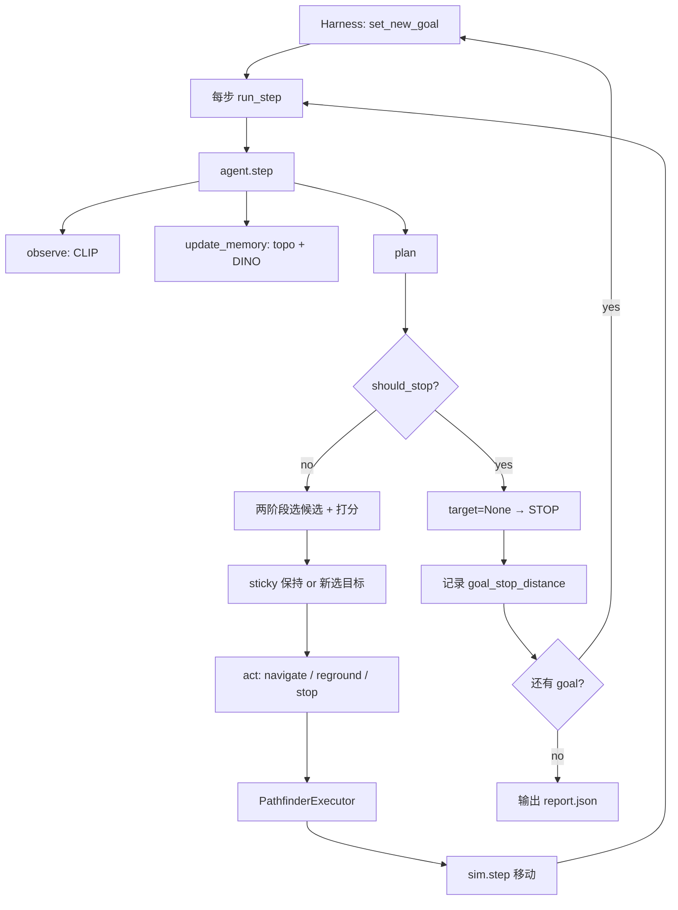

# Multigoal Navigation Logic - ConfTopo-GOAT

> 本文档说明 **multigoal acceptance harness** 与 **ConfTopo-GOAT Agent** 在多目标场景下的完整导航逻辑：goal 切换、记忆复用、规划决策、停止判定、底层执行与 SR/SPL 评估。
>
> 单步 Agent 内部的感知 / 拓扑图 / 两阶段规划细节，见 [TOPO_NAVIGATION.md](./TOPO_NAVIGATION.md)。

---

## 1. 总体架构

Multigoal 导航由两层组成：

```text
┌─────────────────────────────────────────────────────────────┐
│  Harness: scripts/run_goat_multigoal_acceptance.py          │
│  - 加载场景 / episode / goal_graph                          │
│  - 按 goal 循环调用 agent                                   │
│  - PathfinderExecutor 低层动作                              │
│  - SR / SPL / memory reuse 统计                             │
└──────────────────────────┬──────────────────────────────────┘
                           │ agent.step(obs) 每步
┌──────────────────────────▼──────────────────────────────────┐
│  Agent: conftopo/agents/goat_agent.py (ConfTopoGOATAgent)   │
│  observe → update_memory → plan → act                       │
│  - DynamicTopoMap（跨 goal 保留）                           │
│  - 两阶段规划 + sticky target + should_stop                 │
└─────────────────────────────────────────────────────────────┘
```

**关键约定**：Agent 负责「选哪个 topo 节点去」；Harness + `PathfinderExecutor` 负责「怎么在 Habitat 里走过去」。

---

## 2. Harness 执行流程

入口脚本：`scripts/run_goat_multigoal_acceptance.py`

### 2.1 Episode 初始化

```text
1. pick_episode() 加载 GOAT-Bench episode
2. load_goal_graph() 加载 goal 列表（CLIP embedding / room_prior / landmarks）
3. _build_goat_goal_index() 从 dataset goals 字段索引 GT object 位置
4. 创建 ConfTopoGOATAgent（整个 episode 只建一次）
5. make_sim() + set_start_state()，记录 origin = episode start world position
6. agent.set_goal(instruction_graph)  # 绑定第一个 goal
```

### 2.2 Multigoal 主循环

```python
for idx, goal in enumerate(goals[:max_goals]):
    agent.set_new_goal(goal)          # 切目标，不清 topo_map
    for step in range(steps_per_goal):
        rec = run_step(...)
        if rec["low_action"] == "stop":
            记录 goal_stop_distance
            break
    统计本 goal 的 SR / SPL / memory reuse
```

每个 goal 最多跑 `steps_per_goal` 步；Agent 主动 `stop` 时提前结束当前 goal，进入下一个 goal。

### 2.3 单步 `run_step()` 逻辑

```text
1. sim 取 RGB + agent world pose
2. CLIP encode → rgb_embed
3. agent.step({rgb, rgb_embed, position=world_pos, heading})
4. 根据 agent 输出决定底层动作：
```

| Agent 输出 | Harness 行为 |
|------------|--------------|
| `action in {turn_left, turn_right, move_forward}` | 直接 `sim.step(action)`（reground 扫描等） |
| `target_position is None` | `action = "stop"` |
| `target_position` 有值 | `PathfinderExecutor` 规划低层动作 |

**Pathfinder 分支**（最常见）：

```text
1. executor.select_reachable_candidate(top_k=5)
   从 agent 给出的 candidate_ids + scores 里，选第一个 geodesic 可达节点
2. executor.step(sim, target_position, origin)
   → move_forward / turn_left / turn_right / target_reached / unreachable
3. unreachable → agent.on_navigation_event(target_id, "unreachable")
                 → block target + harness 执行 turn_left
4. target_reached / collision_like → consume or block target
5. sim.step(low_action)
```

### 2.4 Harness 侧容错机制

| 机制 | 触发条件 | 行为 |
|------|----------|------|
| stuck target block | 同一 target 连续 24 步，平面距离改善 < 0.25m | `on_navigation_event("no_progress_multigoal")` → block |
| no-move recovery | 连续 10 步 world 位移 < 0.01m | 强制 `sim.step("move_forward")` |
| collision_like | `CollisionLikeTracker` 检测到碰撞式停滞 | 当作 `target_reached`，触发 consume/block |

### 2.5 坐标系

| 变量 | 坐标系 | 用途 |
|------|--------|------|
| `obs["position"]` | Habitat world | 传给 agent |
| `agent._position` | episode-start 相对 | topo_map 内部存储 |
| `rec["world_position"]` | Habitat world | SR/SPL 评估 |
| `rec["position"]` | episode-start 相对 | trace 可视化 |
| `origin` | episode start world | harness 统一参考点 |

Agent 在 `observe()` 中做：`self._position = raw_position - self._origin_position`。

---

## 3. Multigoal 下的 Goal 切换

方法：`ConfTopoGOATAgent.set_new_goal(goal)`

### 3.1 跨 goal 保留（不清空）

- `DynamicTopoMap` 全部节点与边（waypoint / object / room / landmark）
- Agent 当前物理位置与 `_origin_position`
- Episode 级统计（`_goals_completed` 等）

### 3.2 每个 goal 重置

| 状态 | 说明 |
|------|------|
| `_goal_local_step` | 当前 goal 内步数，用于 warmup / should_stop |
| `_goal_travel_distance` | 当前 goal 内累计移动距离 |
| `_sticky_target_id` | sticky 目标（`set_new_goal` 时 `_clear_sticky("new_goal")`） |
| `_recent_goal_detections` | 近期 heavy 检测到 goal 的步号列表 |
| `_last_heavy_step` | heavy 感知 cooldown 基准 |
| `_last_stop_debug` | 上一步 should_stop 诊断 |
| reground 状态 | `_reset_reground_state()` |
| 所有 OBJECT/LANDMARK 的 `target_relevance` | 置 0，新 goal 重新标注 |

### 3.3 Perceiver 更新

```text
perceiver.set_goal_labels(target_object, target_embedding)
perceiver.set_landmark_labels(landmarks, landmark_embeddings)  # 若有
```

后续 CLIP 打分与 GroundingDINO prompt 都围绕**当前 goal** 进行；复合目标如 `"oven and stove"` 会通过 `_split_compound_label()` 拆成 `{"oven", "stove", "oven and stove"}`。

---

## 4. Agent 四步循环（Multigoal 上下文）

每步：`observe → update_memory → plan → act`（见 `base_agent.py`）。

### 4.1 observe()

- 更新 `_position`（相对坐标）、`_heading`、`_goal_travel_distance`
- CLIP light perception → `goal_scores`, `room_label`, `best_goal_sim`
- 清空 `_cur_heavy_observations`（heavy 在 `update_memory` 中按需运行）

### 4.2 update_memory()

```text
_goal_local_step += 1
1. _add_visited_waypoint()           # WAYPOINT_VISITED，连 NAVIGABLE 边
2. _consume_reached_frontiers()      # 半径内 frontier → consumed
3. _add_semantic_nodes()             # CLIP 房间 / landmark
4. _add_heavy_object_nodes()         # GroundingDINO（按触发条件）
5. _generate_frontiers()             # 位移式 / 初始四向 frontier
6. decay / merge / prune / assign_waypoint_to_room
```

**OBJECT 位置**：所有 object（VLM / GroundingDINO / CLIP）使用观测 waypoint 作为
semantic anchor position（`position_source = "anchor_waypoint"`），不做 bbox depth 估计。

**Heavy 感知触发优先级**（`_should_run_heavy_perception`）：

```text
1. local_regrounding（转圈扫描中）                    → 强制
2. stop_confirmation_near_goal（2m 内有 goal object，
   且距上次 heavy ≥ 3 步）                           → 强制（绕过 interval cooldown）
3. cooldown 检查（默认 heavy_interval=7）
4. goal_warmup / room_summary / interval /
   high_goal_sim / frontier_context / low_object_conf
```

命中 goal label 的 heavy 检测会写入 `_recent_goal_detections`（供 `should_stop` 的 `recent_confirm` 使用）。

### 4.3 plan()

```text
if should_stop():
    return target=None                    → 后续 act 输出 stop

if reground 进行中:
    return local_reground 计划

# Stage 1（可选）
structure_target = _select_structure_target()   # ROOM / portal LANDMARK

# Stage 2
收集候选 → 过滤 → compute_semantic_bias → structure_anchor_bonus
→ sticky_plan_if_valid or argmax 选最高分
→ _target_output_for_node() 输出 target_position
```

**候选过滤**（`_candidate_skip_reason`）：

| reason | 条件 |
|--------|------|
| `current` | 当前 waypoint |
| `folded_detail` | 已折叠（goal object / target_relevance>0 例外） |
| `consumed` | 已消费 frontier |
| `blocked` | TTL 内被 block（默认 20 步） |
| `too_close` | 距 agent < 0.45m 的 frontier |

**结构锚点附加过滤**（`_candidate_anchored_skip_reason`）：

- 有 `structure_target` 时，远离 anchor 的**非 goal** OBJECT 被跳过
- **goal object 永不过滤**

**候选集合**：

```text
primary:   FRONTIER / CANDIDATE / OBJECT / room_region
fallback:  WAYPOINT_VISITED（primary 为空时）
```

**打分公式**（`rule_scorer.py`，不归一化直接 argmax）：

```text
score = object_match(0.55*sim)
      + room_prior(0.3) + room_contains(0.25)
      + landmark(0.2*max_sim) + neighbor_object(0.2*sim)
      + frontier_bonus(0.1)
      - distance_penalty(0.08*dist/20)
      - visit_penalty(0.1*visit/5)
      + confidence_bonus(0.1*conf)
      + structure_anchor_bonus
```

### 4.4 Sticky Target（防振荡）

```text
选中最高分节点 → 记入 _sticky_target_id

每步优先追 sticky：
  - 节点仍存在且未 consumed/blocked → 继续追
  - 即使本步不在 candidate 列表里也保持（防 structure_target 变化导致抖动）
  - 距离持续减小 → 保持
  - 连续 N 步无进展 → block + 释放 sticky
  - 到达 sticky_reach_radius(0.75m) → consume/block
```

### 4.5 Reground（折叠 object 二次定位）

当选中 **folded object anchor**（`requires_regrounding=True`）：

```text
导航到 anchor_waypoint
→ 到达后 local_reground_scan：原地 turn_right × 8
→ 期间跑 heavy，检测到 goal object → 更新目标
→ 否则进入 searching 继续找
```

### 4.6 act()

```text
local_reground_scan  → turn_right（直接底层动作）
requires_regrounding 且到达 anchor → 启动扫描
target_position is None → action = "stop"
否则 → action = "navigate", 输出 target_position 给 executor
```

每步附带 `stop_debug`（`should_stop` 各条件状态）、`sticky_debug`、`last_heavy` 等诊断字段。

---

## 5. should_stop() 停止逻辑

文件：`goat_agent.py`

### 5.1 Warmup 门槛

```text
_goal_local_step >= 8  AND  _goal_travel_distance >= 0.5m
```

未过 warmup → 不允许 stop。

### 5.2 四个信号

| 信号 | 条件 |
|------|------|
| `topo_near_ok` | topo_map 中匹配 goal 的 OBJECT 节点 ≤ **0.8m** |
| `topo_close_ok` | 同上，但 ≤ **2.0m** |
| `heavy_confirm_ok` | 当前帧 GroundingDINO 检测到 goal，bbox 归一化面积 > **15%** |
| `recent_confirm_ok` | 近 **5 步**内 heavy 曾检测到 goal（`_recent_goal_detections`） |

### 5.3 停止条件（满足其一）

```text
(heavy_confirm_ok AND topo_close_ok)
OR
(topo_near_ok AND recent_confirm_ok)
```

**设计意图**：

- 单靠 heavy bbox 不够（可能远处误检同类物体）→ 必须 topo 在 2m 内
- 单靠 topo 节点距离不够（bbox 估算误差可达 1m+）→ 必须近期有 heavy 视觉确认
- 两者组合才 stop

### 5.4 触发链路

```text
should_stop() == True
  → plan() 返回 target=None
  → act() 返回 action="stop"
  → harness low_action="stop"
  → 结束当前 goal，记录 goal_stop_distance
```

### 5.5 stop_debug 字段

每步 `should_stop()` 写入 `_last_stop_debug`，经 `act()` 输出到 trace：

```json
{
  "stop_allowed": false,
  "reason": "no_stop_confirmation",
  "topo_near_ok": false,
  "topo_close_ok": true,
  "nearest_goal_dist": 1.2,
  "heavy_confirm_ok": false,
  "heavy_bbox_area": 0.08,
  "recent_confirm_ok": true,
  "recent_detections_count": 3,
  "goal_local_step": 42,
  "goal_travel_distance": 5.3
}
```

---

## 6. 导航事件与 Target 生命周期

`on_navigation_event(target_node_id, event)` → `_consume_or_block_target()`：

| event | 对 FRONTIER | 对 OBJECT / VISITED |
|-------|-------------|---------------------|
| `target_reached` | consumed（不再候选） | blocked（TTL=20 步） |
| `unreachable` | blocked | blocked |
| `collision_like` | consumed | blocked |
| `no_progress` / `no_progress_multigoal` | blocked | blocked |
| sticky `target_reached` | consumed | blocked |

blocked 期间该节点不会进入候选；TTL 过期后可再次被选中。

---

## 7. SR / SPL 评估逻辑

### 7.1 GT 位置来源

优先级（`_resolve_goat_gt_positions`）：

```text
1. GOAT dataset goals.object_id（task 指定时）
2. GOAT dataset goals.object_category（含 compound split）
3. sim.semantic_scene 回退（HM3D 通常为空）
```

### 7.2 Success 判定（当前标准）

```text
goal_stopped       = agent 是否发出 stop（low_action == "stop"）
goal_stop_distance = stop 时 agent world_pos 到最近 GT instance 的欧氏距离
goal_min_distance  = 全程最近距离（仅 debug，不算 success）

goal_success = goal_stopped AND goal_stop_distance <= 1.0m
```

**注意**：`goal_min_distance` 只表示「是否曾经靠近过」，不能作为 success 依据。

### 7.3 SPL 计算

仅 `goal_success == True` 时计算：

```text
goal_optimal_path = 从 goal 起点到最近 GT instance 的最短 geodesic 距离
goal_path_length  = goal 期间 agent 实际行走距离（world 坐标累计）
goal_spl          = optimal / max(actual, optimal)
```

### 7.4 Trace 输出字段（每个 task）

```json
{
  "task_index": 0,
  "target_object": "display cabinet",
  "goal_stopped": true,
  "goal_stop_distance": 0.85,
  "goal_min_distance": 0.72,
  "goal_success": false,
  "goal_path_length": 12.5,
  "goal_optimal_path": 8.3,
  "goal_spl": null,
  "memory_reuse_hits": 45,
  "semantic_reuse_hits": 12,
  "steps": 120
}
```

---

## 8. Memory Reuse 统计

Harness 在每个 goal 开始时记录 `known_before = topo_map 全部 node_id`。

每步若 `target_node_id in known_before`：

- `memory_reuse_hits += 1`（任意已知节点）
- 若 `target_node_id` 是语义节点（`obj_` / `roo_` / `lan_` 前缀）→ `semantic_reuse_hits += 1`

Multigoal 的价值在于：**后面 goal 可以直接导航到前面 goal 期间建立的 object/frontier/room 节点**，而不必重新探索。

---

## 9. 端到端数据流



---

## 10. 运行命令

```bash
cd /workspace/tangyx7@xiaopeng.com

conda run -n goat python scripts/run_goat_multigoal_acceptance.py \
    --split val_seen --scene 5cdEh9F2hJL --episode-index 0 \
    --max-goals 10 --steps-per-goal 500 \
    --dataset-dir data/datasets/goat_bench/hm3d/v1 \
    --scene-root data/scene_datasets/hm3d \
    --goal-graph-dir data/goal_graphs/goat \
    --output data/logs/goat_topo/final_14scenes/5cdEh9F2hJL_multigoal.json \
    --report data/logs/goat_topo/final_14scenes/5cdEh9F2hJL_report.json \
    --heavy-enabled --heavy-interval 7 \
    --groundingdino-config third_party/GroundingDINO/groundingdino/config/GroundingDINO_SwinT_OGC.py \
    --groundingdino-checkpoint third_party/GroundingDINO/weights/groundingdino_swint_ogc.pth \
    --groundingdino-device cuda
```

`--record-topo` 会在每步保存 topo 快照，trace 体积大，仅调试时开启。

---

## 11. 已知局限

| 问题 | 影响 | 当前缓解 |
|------|------|----------|
| OBJECT 位置来自 bbox 估算 | topo_near / topo_close 误差大 | should_stop 要求 heavy + topo 联合确认 |
| GroundingDINO 误检同类物体 | 可能错误 stop | heavy_confirm 必须 topo_close ≤ 2m |
| Heavy 不是每步运行 | 漏检 / 漏停 | near-goal 强制触发 heavy（≥3 步间隔） |
| Frontier 依赖位移生成 | 原地打转时探索慢 | harness no-move recovery（10 步强制 forward） |
| Executor 用 topo 节点坐标 | geodesic 可能 unreachable | top-5 可达候选回退 + block 机制 |
| HM3D semantic_scene 为空 | 只能靠 dataset goals 做 GT | `_resolve_goat_gt_positions` 优先读 GOAT JSON |

---

## 12. 相关文件

| 文件 | 职责 |
|------|------|
| `scripts/run_goat_multigoal_acceptance.py` | Multigoal harness、SR/SPL、trace |
| `conftopo/agents/goat_agent.py` | Agent 核心逻辑 |
| `conftopo/agents/base_agent.py` | observe/plan/act 循环框架 |
| `conftopo/core/rule_scorer.py` | 候选语义打分 |
| `conftopo/core/dynamic_topo_map.py` | 拓扑记忆图 |
| `conftopo/navigation/pathfinder_executor.py` | Habitat 低层路径执行 |
| `docs/TOPO_NAVIGATION.md` | 单 goal Agent 内部逻辑详解 |

---

## 13. 变更记录

| 日期 | 变更 |
|------|------|
| Phase 3.8 | bbox 自适应距离、compound target、评分权重调整、sticky 不受 candidate 过滤影响 |
| Phase 3.9 | `goal_success` 改为 stop 位置判定；`should_stop` 多条件联合；heavy near-goal 强制触发；no-move recovery |
